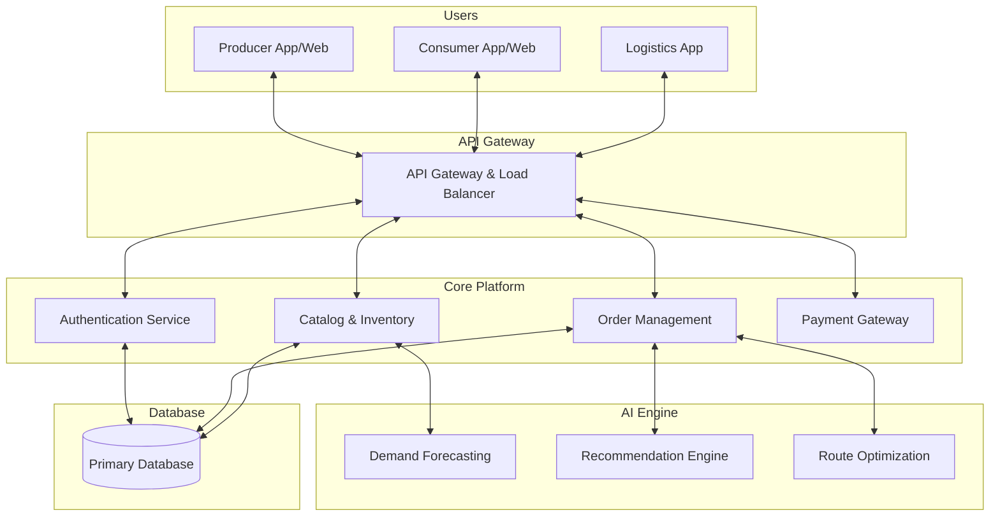
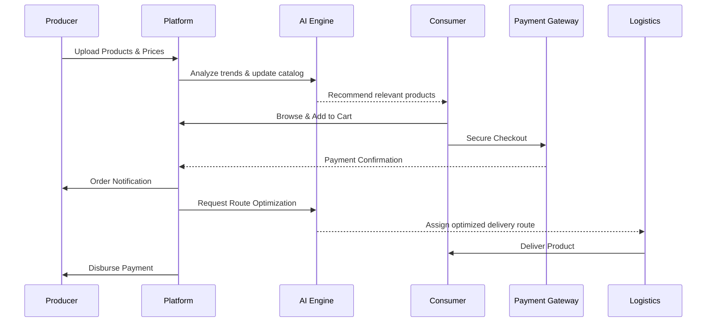

# Smart Marketplace Platform: Project Presentation

---

## 1. Project Title and Tagline
**NexusMarket**  
*Bridging the Gap: Smart, Direct, and Transparent.*

## 2. Problem Statement
Traditional supply chains are bloated with intermediaries, leading to inflated consumer prices, marginalized producer profits, and significant product wastage due to inefficiencies, poor logistics, and a severe lack of price transparency.

## 3. Existing System
The current distribution model relies on a multi-tier hierarchy:  
`Producer → Wholesaler → Distributor → Retailer → Consumer`  
It is largely manual, fragmented, and lacks real-time data integration for supply and demand matching.

## 4. Limitations of Existing System
* **Price Inflation:** Consumers pay significantly more than the production cost.
* **Low Producer Margins:** Producers receive only a small fraction of the final sale price.
* **Opacity:** Complete lack of price transparency and traceability.
* **High Wastage:** Inefficient logistics and poor demand forecasting lead to spoilage and overproduction.

## 5. Proposed Solution
Design an AI-driven digital marketplace that facilitates direct producer-to-consumer (D2C) transactions. The platform provides complete pricing transparency, optimizes delivery logistics, and utilizes machine learning to accurately predict market demand.

## 6. Novelty
* **Transparent Cost Breakdown:** Consumers see the exact split of their payment (e.g., 85% to Producer, 10% to Logistics, 5% to Platform).
* **AI-Driven Demand Matching:** Proactively predicts local consumer demand to advise producers on supply, minimizing product wastage.
* **Smart Route Consolidation:** Dynamically groups orders geographically to reduce logistics overhead and carbon footprint.

## 7. Objectives
* Eliminate unnecessary middlemen to maximize producer earnings.
* Provide consumers with authentic, fresher products at lower prices.
* Optimize logistics to reduce delivery times and environmental impact.
* Foster a transparent, trust-based digital economy.

## 8. Key Features
* Direct Producer-to-Consumer connection
* Transparent pricing and granular cost breakdown
* AI-based demand prediction and forecasting
* Smart product discovery and recommendations
* Logistics and delivery route optimization
* Dedicated producer and consumer dashboards
* Secure online payments and escrow
* Granular analytics and reports

## 9. System Architecture

## 10. Data Flow Diagram

## 11. Working Methodology
1. **Onboarding:** Producers and consumers register securely on the platform.
2. **Listing & Discovery:** Producers list inventory; consumers discover products via AI-curated personalized feeds.
3. **Transaction:** Consumer purchases securely; a transparent cost breakdown is displayed at checkout.
4. **Fulfillment:** The AI engine calculates the most efficient delivery route and assigns it to a logistics partner.
5. **Settlement:** Automated, secure payouts are released directly to the producer upon successful delivery.

## 12. AI/ML Components
* **Demand Forecasting:** Time-series analysis to predict future market needs.
* **Price Analysis:** Real-time pricing suggestions based on competitor and market data.
* **Product Recommendation:** Collaborative filtering to match consumer preferences.
* **Route Optimization:** Heuristic algorithms to find the fastest, most fuel-efficient delivery paths.
* **Fraud Detection:** Anomaly detection models to flag abnormal transactions or fake reviews.

## 13. Technology Stack
* **Frontend:** React.js / React Native (Cross-platform)
* **Backend:** Node.js / Express (Core API), Python/FastAPI (AI Microservices)
* **Database:** PostgreSQL (Relational Data), MongoDB (Catalogs)
* **AI/ML:** TensorFlow, Scikit-learn
* **Cloud & DevOps:** AWS, Docker, GitHub Actions (CI/CD)

## 14. User Roles
* **Producer:** Manage inventory, view demand insights, track earnings.
* **Consumer:** Browse products, track orders, leave reviews.
* **Logistics Partner:** View assigned routes, update real-time delivery status.
* **Admin/Platform Operator:** Monitor platform health, resolve disputes, analyze system metrics.

## 15. Feasibility
* **Technical:** Highly feasible utilizing proven web frameworks and accessible cloud-based AI tools.
* **Economic:** Sustainable revenue model via nominal transaction fees rather than heavy markups.
* **Operational:** Highly scalable; can launch as a localized pilot and expand regionally.

## 16. Challenges and Solutions
* **Challenge:** Digital literacy barrier among rural or traditional producers.
  **Solution:** Develop an intuitive, multilingual interface with voice-assistance features.
* **Challenge:** Efficient, cost-effective last-mile delivery.
  **Solution:** Implement AI-powered route batching and partner with local gig-economy delivery agents.

## 17. Impact and Benefits
1. Significantly higher income and profit margins for producers.
2. Affordable, high-quality, and traceable products for consumers.
3. Total price transparency, promoting ethical commerce.
4. Substantial reduction in supply chain wastage and spoilage.
5. Enhanced trust and direct communication between creators and buyers.

## 18. Future Scope
* **Blockchain Integration:** Implement smart contracts for absolute traceability and immutable ledgers.
* **Subscription Models:** Enable recurring automated deliveries for staple items.
* **B2B Expansion:** Facilitate direct bulk trading between producers and businesses/restaurants.

## 19. Project Roadmap
* **Month 1:** Requirement analysis, UI/UX design, and database modeling.
* **Month 2:** Core platform development (Authentication, Catalog, Cart).
* **Month 3:** AI integration (Recommendations, Forecasting) and Payment Gateway setup.
* **Month 4:** Route optimization logistics integration and Beta testing.
* **Month 5:** Final bug fixes, security auditing, and official localized launch.

## 20. Conclusion
NexusMarket completely redefines digital commerce by putting power back into the hands of producers and consumers. By cutting out unnecessary intermediaries and leveraging smart AI components, we are building a fairer, faster, and radically transparent marketplace for the future.
